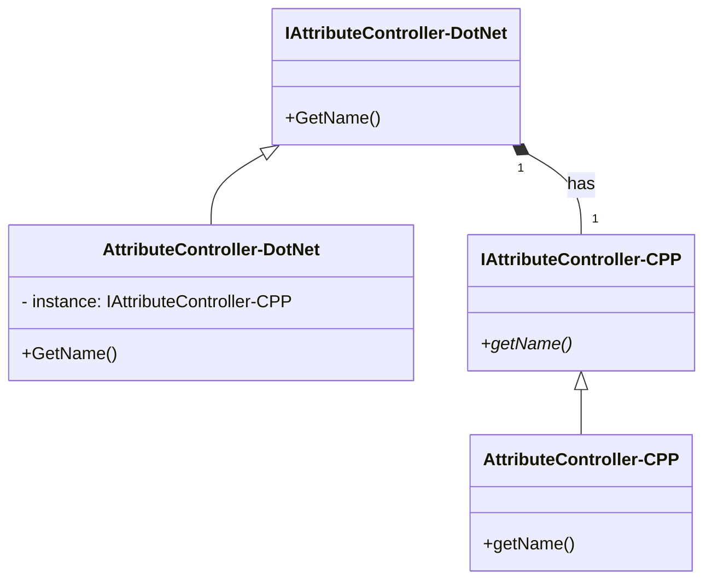
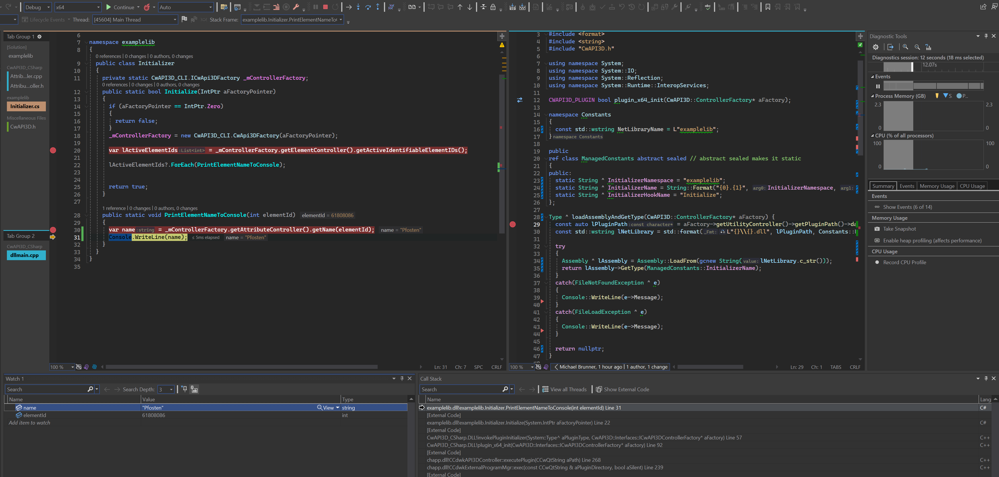

# CwAPI3D.Net.Bridge

This project serves as a .NET bridge for the C++ API from cadwork 3d. It leverages the power of C++ CLI (Common Language Infrastructure) to provide a seamless integration between the .NET environment and the cadwork 3d API. This allows developers to utilize the robust features of cadwork 3d API within their .NET applications.

[](https://github.com/Brunner246/CwAPI3D_CSharp/actions/workflows/build.yml)

[](https://github.com/Brunner246/CwAPI3D.Net.Bridge/actions/workflows/release.yml)

## Getting Started

Clone the repository to your local machine.

```bash
git clone https://github.com/Brunner246/CwAPI3D.Net.Bridge.git
```

Update the macros in `CwAPI3D.props` to point to the correct paths for cadwork. The macros are used to include the necessary headers and for copying the DLLs as a post-build event into the userprofile directory.

```xml
  <PropertyGroup Label="UserMacros">
    <CwAPI3D>./CwAPI3D/includes</CwAPI3D>
    <USERPROFILE_API>D:\cadwork\userprofil_30\3d\API.x64</USERPROFILE_API>
    <AssemblyName>CwAPI3D.Net.Bridge</AssemblyName>
    <API_NAME>CwAPI3D.Net.Bridge</API_NAME>
  </PropertyGroup>
```

### Prerequisites

- Visual Studio 2022 or JetBrains Rider
- .NET Framework 4.8
- Install C++/CLI support in Visual Studio (Visual Studio Installer -> Modify -> Individual Components -> C++/CLI support)

### C++ CLI 
[.NET programming with C++/CLI](https://learn.microsoft.com/en-us/cpp/dotnet/dotnet-programming-with-cpp-cli-visual-cpp?view=msvc-170)

[Walkthrough: Compile a C++/CLI program](https://learn.microsoft.com/en-us/cpp/dotnet/walkthrough-compiling-a-cpp-program-that-targets-the-clr-in-visual-studio?view=msvc-170)

#### C++/CLI Syntax

```cpp
using namespace System;

////////////////////////// managed C# code //////////////////////////

public ref class Greeter
{
    public:
        Greeter(String^ name)
        {
            this->name = name;
        }

        String^ Greet()
        {
            return "Hello, " + name;
        }
    private:
        String^ name;
}

////////////////////////// native CXX code //////////////////////////

public ref class MyClass
{
    public:

        MyClass()
        {
            mPoint = new C3dPoint();
        }

        explicit MyClass(const double aX, const double aY, const double aZ)
        {
            Console::WriteLine("Hello from C++/CLI!");
            mPoint = new C3dPoint(aX, aY, aZ);
        }
        
        explicit MyClass(const C3dPoint% p)
        {
            mPoint = new C3dPoint(p);
        }

        // Destructor
        ~MyClass()
        {
            this->!MyClass();
        }

        // Finalizer
        !MyClass()
        {
            Console::WriteLine("Finalizer from C++/CLI!");
            delete mPoint;
        }

        property C3dPoint* Point
        {
            C3dPoint* get()
            {
                return mPoint;
            }
        }

    private:
        C3dPoint* mPoint;
};
```

## Design `CwAPI3D` Controller Implementation (Bridge Pattern)  



## Debugging

### Debugging in Visual Studio

1. Open the project in Visual Studio.
2. Set the project to run in 64-bit mode.
3. Set the project to run in Debug mode.
4. Attach the debugger to the process `3d.exe`.




## Contributing

Please read [CONTRIBUTING.md](CONTRIBUTING.md) for details on our code of conduct, and the process for submitting pull requests to us.

## License

This project is licensed under the MIT License - see the [LICENSE.md](LICENSE.md) file for details

## Contributing Back

If you extend or improve the CwAPI3D bridge, please commit your changes back to this repository. This way, all users can benefit from the enhancements. Your contributions help make the CwAPI3D .NET bridge better for everyone.
